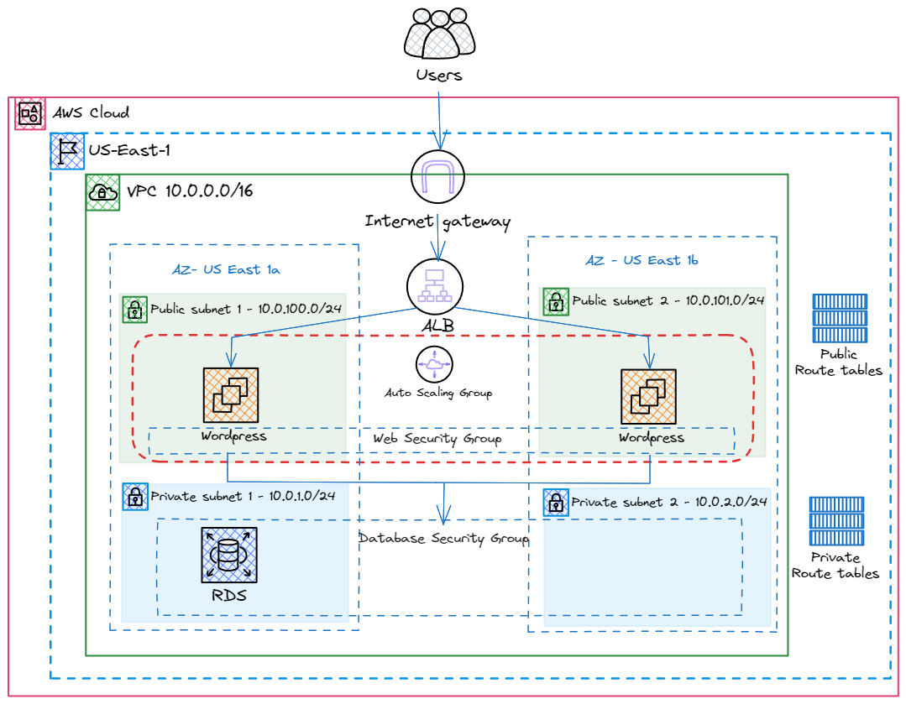

# WordPress High Availability Setup on AWS

This repository contains Terraform scripts to set up a highly available and scalable WordPress application on AWS. The architecture leverages various AWS services, including VPC, EC2, RDS, ALB, and Auto Scaling Group, to ensure fault tolerance, security, and performance.

## Architecture Overview



### Components

- **AWS Region**: US East 1
- **VPC**: 10.0.0.0/16
- **Public Subnets**:
  - 10.0.100.0/24 (AZ: US East 1a)
  - 10.0.101.0/24 (AZ: US East 1b)
- **Private Subnets**:
  - 10.0.4.0/24 (AZ: US East 1a)
  - 10.0.8.0/24 (AZ: US East 1b)
- **Internet Gateway**: Provides internet access to public subnets.
- **Application Load Balancer (ALB)**: Distributes incoming traffic across multiple WordPress instances.
- **Auto Scaling Group (ASG)**: Ensures high availability and scalability of WordPress instances.
- **WordPress Instances**: Deployed in public subnets, managed by ASG.
- **RDS (MySQL)**: Deployed in private subnets for secure database management.
- **Security Groups**:
  - Web Security Group: Applied to WordPress instances.
  - Database Security Group: Applied to RDS instance.
- **Route Tables**:
  - Public Route Tables: Associated with public subnets.
  - Private Route Tables: Associated with private subnets.

## Prerequisites

- AWS Account
- Terraform installed on your local machine
- AWS CLI configured with necessary permissions

## Getting Started

### Clone the Repository

```sh
git clone https://github.com/ssram4298/terraform-wordpress.git
cd terraform-wordpress
```

### Configure AWS Credentials

Ensure your AWS CLI is configured with the necessary credentials:

```sh
aws configure
```

### Customize Variables

Edit the `variables.tf` file to customize the configuration according to your requirements:

```hcl
variable "region" {
  description = "AWS Region"
  default     = "us-east-1"
}

variable "vpc_cidr" {
  description = "VPC CIDR"
  default     = "10.0.0.0/16"
}

variable "public_subnets" {
  description = "Public Subnets CIDRs"
  default     = ["10.0.100.0/24", "10.0.101.0/24"]
}

variable "private_subnets" {
  description = "Private Subnets CIDRs"
  default     = ["10.0.4.0/24", "10.0.8.0/24"]
}

# Add other variables as necessary
```

### Initialize Terraform

Initialize the Terraform working directory:

```sh
terraform init
```

### Apply the Configuration

Review the execution plan and apply the configuration:

```sh
terraform plan
terraform apply
```

### Access Your Application

After the Terraform script completes, you can access your WordPress application using the DNS name provided by the ALB.

## Cleanup

To destroy the resources created by Terraform, run:

```sh
terraform destroy
```

## Contributing

Contributions are welcome! Please fork the repository and create a pull request.

## License

This project is licensed under the MIT License. See the [LICENSE](LICENSE) file for details.

## Acknowledgements

- Inspired by the amazing blog post of Alok Trivedi - https://medium.com/@aaloktrivedi/creating-a-ci-cd-pipeline-with-terraform-cloud-to-deploy-wordpress-application-infrastructure-part-8f1cb9f4f022
- Thanks to the Terraform community for their valuable contributions.

---
